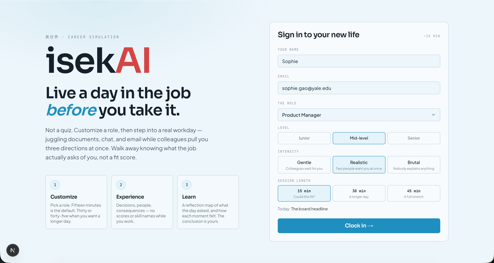
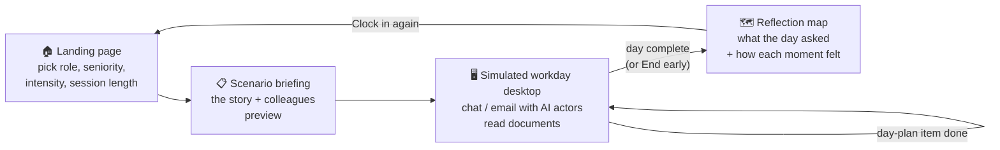
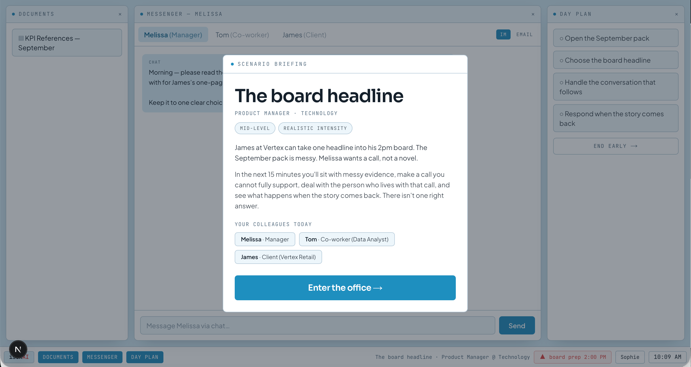
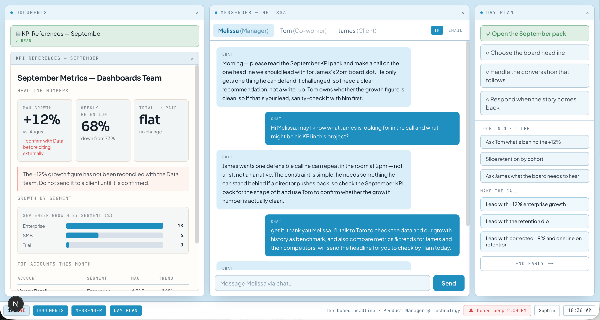
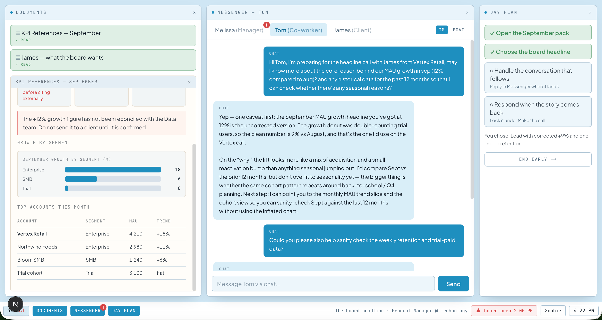
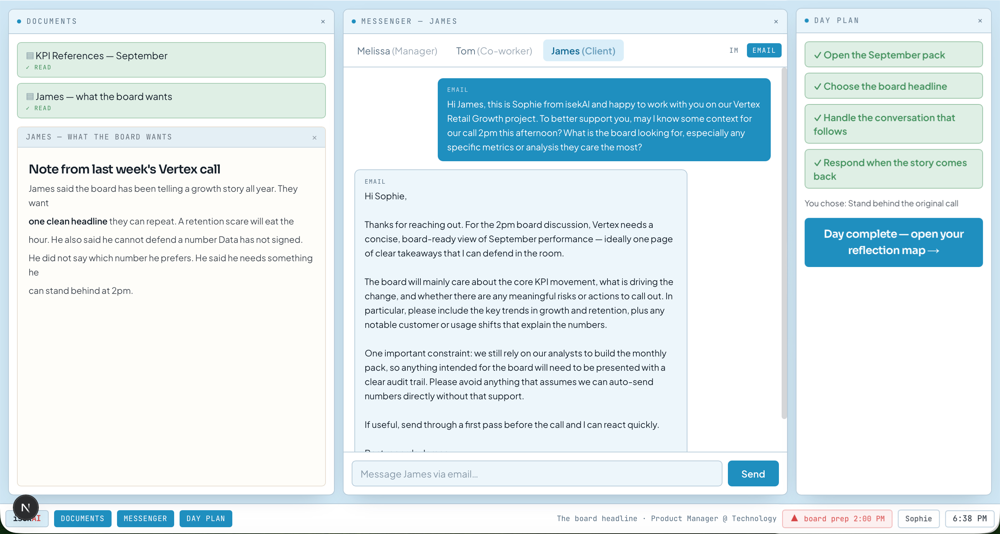
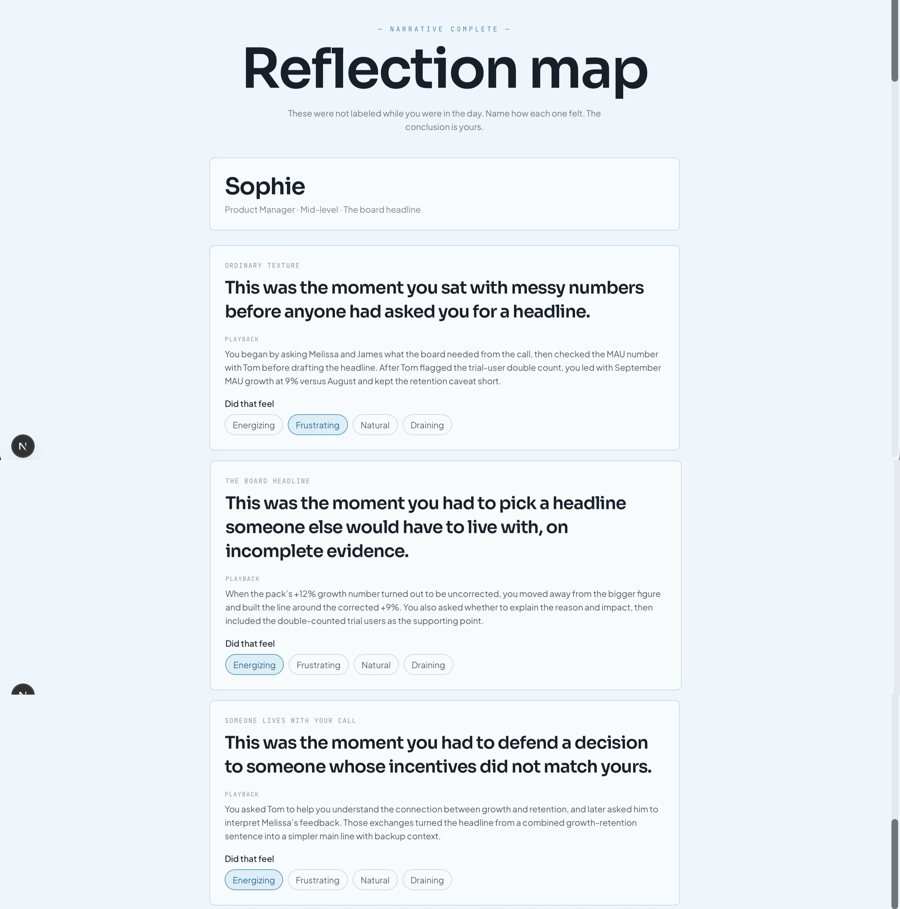
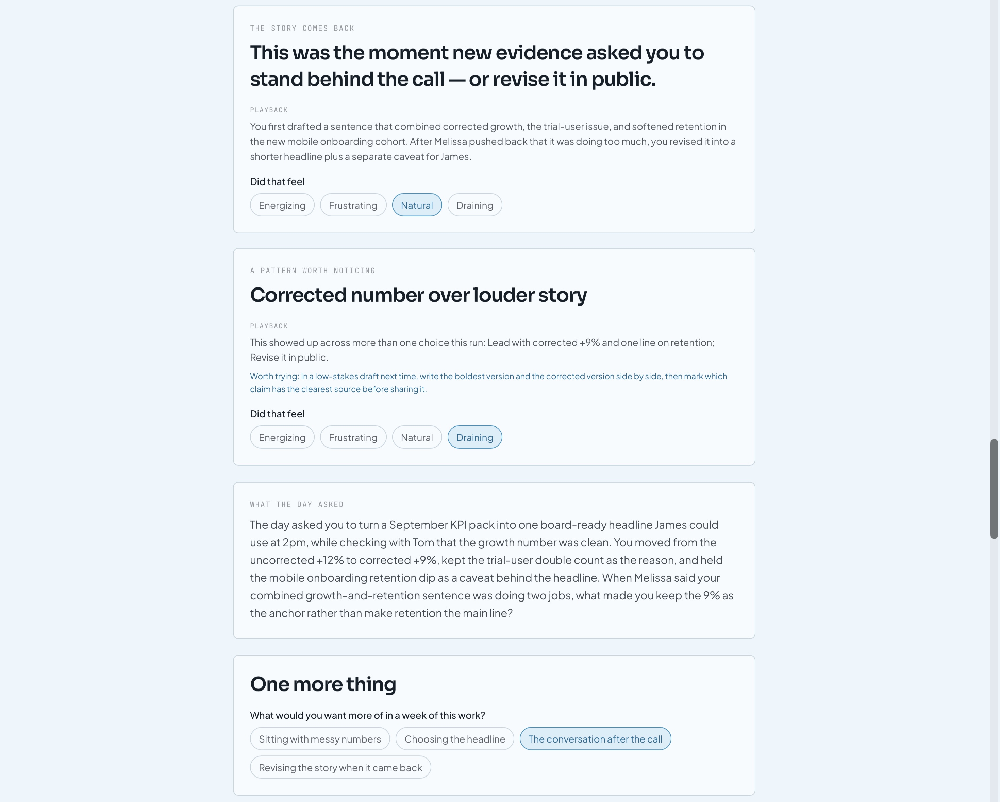
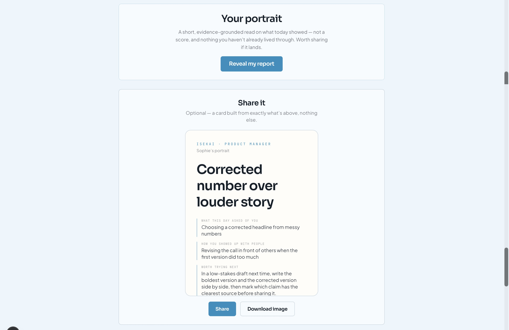
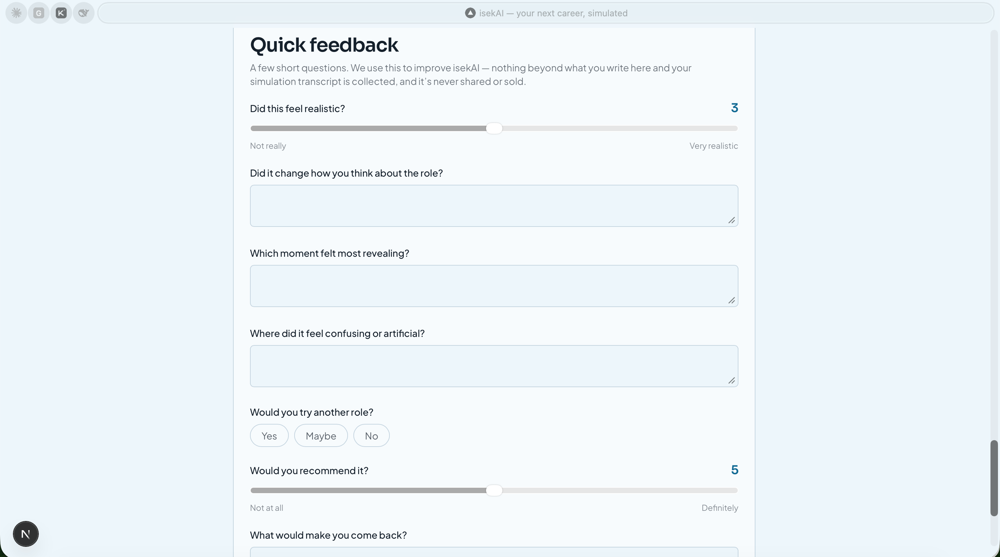

# isekAI — your next career, simulated

**Try on a job for a day, before you commit years to it.**

isekAI drops you into a realistic, AI-powered “day in the life” of a role 
you’re curious about, starting with Product Manager, with more roles coming. 
You’ll get real messages from a boss, coworker, and client, real documents 
to work through, and real decisions to make. At the end of the workday, 
you’ll get a reflection map showing what the role actually asked of you, how the 
experience felt, and a career portrait card designed to help you evaluate your fit.

## 👉 Try it

**[isekai-web-pink.vercel.app](https://isekai-web-pink.vercel.app)** — no
signup beyond a name and email, ~15 minutes, real AI, free.

isekAI is closed-source while we build out the roadmap, but this repo serves as our 
public front door. If you’d like early access to new roles, want to chat about what
we’re building, or have feedback after a run, reach out via the email in my [profile README](https://github.com/sophie-gaoyang/Sophie-gaoyang).

---

## The problem

Picking a career (or a career change) is one of the highest-stakes decisions
most people make with the *least* real information. Job descriptions,
"day in the life" YouTube videos, and info-interviews are all filtered
through someone else's highlight reel. You don't find out what a Product
Manager's Tuesday actually feels like — the conflicting Slack pings, the
data that doesn't quite add up, the client who needs an answer in an hour —
until you're already three months into the job.

## The value

isekAI compresses that discovery into a short interactive simulation
(15 minutes by default):

| For... | isekAI gives you... |
| --- | --- |
| Students & early-career explorers | A realistic preview of a role before choosing a major or applying |
| Career switchers | Low-risk exposure to a new industry's actual day-to-day pressure |
| Bootcamps & career coaches | A shared workday you can talk about — energy and drain, not a grade |
| Anyone curious | A reflection map of what the work asked, not a personality quiz |

Every run is powered by real LLMs acting in character — the boss who nudges
you about a deadline, the coworker who flags a data error, the client who
asks a follow-up question — so no two playthroughs feel scripted the same way
twice, even though the underlying scenario stays consistent and fair.

---

## How it works (user journey)

1. **Customize** — choose an industry/role (Product Manager today, more in
   production), a seniority level, an intensity (how much pressure/ambiguity
   you want), and a session length. Fifteen minutes is the default.
2. **Experience** — land on a simulated desktop with three windows:
   Documents (read the briefs), Messenger (chat/email with AI colleagues),
   and Day plan (your live task list). No scores, meters, or competency
   names while you work. Every message you send gets a real, in-character
   AI reply.
3. **Learn** — finish the day (or hit **End early**) to get a reflection
   map: each moment named in plain language, a playback of what you did,
   and one feeling — energizing, frustrating, natural, or draining. You
   draw the conclusion. End-early maps only the part of the day you reached.

---

## Screenshot tour

### 1. Landing page

Pick your role, seniority, intensity, and session length — then clock in.
Fifteen minutes is the default; thirty and forty-five are there when you want
a longer day.

### 2. Scenario briefing

Before the workday starts, you get the story, the stakes, and who you'll
be working with — not a list of skills the day will grade.

### 3. Simulated desktop

Documents, Messenger, and Day plan run side by side. Every reply is a real,
in-character AI response — not a script. Competency names stay off the
desktop.

### 4. Coworker

Data is a conversation, not a dump. One caveat at a time — then you still
have to make the call.

### 5. Client

Clients live on email. They tell you what the room needs; they do not write
the headline for you.

### 6. Reflection map

When the workday ends, each unlabeled moment is named. You see a playback
of what you did, then choose how it felt. The conclusion is yours — not a
fit score, not an archetype.

### 7. Your portrait

An optional, evidence-grounded read on what the day showed — quoted from
what you actually did, never a score. A share card renders straight from
the same three lines, downloadable or shareable as an image.

### 8. Quick feedback

Short and low-friction on purpose: sliders and pill options for anything
that's really a scale, four open text boxes for anything that needs your
own words.

---

## Status

isekAI is an early-stage MVP, actively growing. Currently shipped:

- ✅ A Product Manager pack with junior, mid, and senior 15-minute days
- ✅ Chat + email channels, documents/artifacts, day-plan tracking
- ✅ Real multi-provider LLM wiring — every reply is a genuine AI response
- ✅ Reflection map debrief (authored stems + playback + your feelings)
- ✅ "End early" flow that maps only the part of the day you reached
- ✅ Shareable portrait report — evidence-grounded, exportable as an image
- ✅ Low-friction feedback form (sliders + pill options, four open questions)

More roles, more scenarios, and a lot of under-the-hood work on making the
simulation feel honest rather than scripted are in progress. isekAI is
closed-source while this is underway — reach out if you'd like to follow
along.

---

© 2026 Sophie Gao. All rights reserved. This repository and its contents
may not be copied, modified, or redistributed without written permission.
